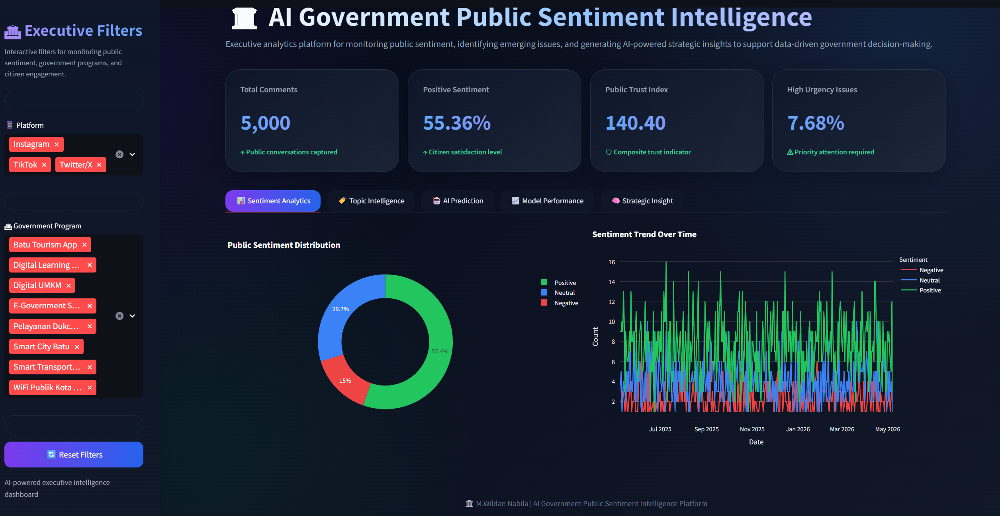
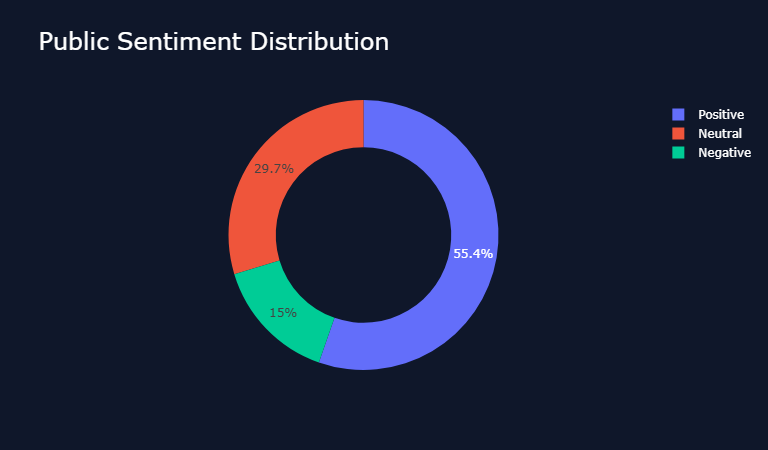
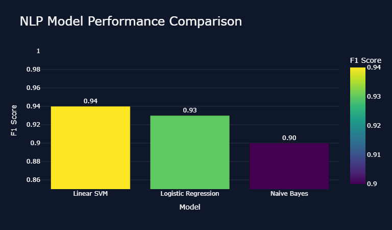
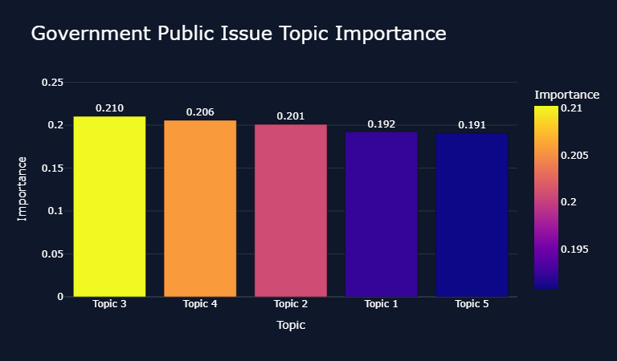

<div align="center">

# 🏛️ AI Government Public Sentiment Intelligence Platform

### NLP-Powered Executive Analytics for Government Communication and Public Opinion Monitoring


### 🟢 Core Project (Data Science / Machine Learning) 2026

🔗 **Live Demo:** https://mwildannabila-ai-powered-public-sentiment-intelligence.streamlit.app/

</div>

---

# 🖥️ Dashboard Preview



> Premium executive dashboard for monitoring citizen sentiment, detecting emerging public issues, and generating AI-powered strategic recommendations.

---

# 🧠 Project Overview

This project develops an end-to-end **Natural Language Processing (NLP)** and **Machine Learning** platform to analyze citizen sentiment toward government digital programs and public communication initiatives.

The system combines sentiment classification, topic modeling, executive KPI design, and interactive dashboard deployment to transform public comments into actionable intelligence for data-driven decision-making.

This project was developed during an internship at **DISKOMINFO Kota Batu** in collaboration with students from **Universitas Islam Negeri Maulana Malik Ibrahim Malang (UIN Malang)** and **Universitas Brawijaya (UB)**.

---

# 🎯 Project Objectives

- Classify public sentiment into Positive, Neutral, and Negative categories.
- Detect dominant public issues using topic modeling (LDA).
- Create a Public Trust Index as an executive KPI.
- Generate AI-powered strategic recommendations.
- Deploy a premium Streamlit dashboard.

---

# 🗂️ Dataset Overview

| Attribute | Value |
|---------|-------|
| Dataset Type | Synthetic Government Public Sentiment Dataset |
| Total Records | 5,000 comments |
| Platforms | Instagram, TikTok, Twitter/X |
| Sentiment Classes | Positive, Neutral, Negative |
| Government Programs | Smart City, Digital UMKM, Public WiFi, Tourism App |

---

# 🧪 Methodology

```text
Data Cleaning & Preprocessing
        ↓
Exploratory Data Analysis (EDA)
        ↓
TF-IDF Vectorization
        ↓
Sentiment Classification (Linear SVM)
        ↓
Topic Modeling (LDA)
        ↓
AI Strategic Insight Engine
        ↓
Executive Dashboard (Streamlit)
        ↓
Streamlit Cloud Deployment
```

---

# 📈 Model Performance

| Model | Accuracy | F1 Score |
|------|---------:|---------:|
| Logistic Regression | 0.93 | 0.93 |
| Naive Bayes | 0.90 | 0.90 |
| Linear SVM | **0.94** | **0.94** |

> 🏆 **Best Model:** Linear SVM

---

# ✨ Key Features

- 🤖 Real-time sentiment prediction
- 🏷️ Topic modeling and public issue detection
- 📊 Public Trust Index
- 🚨 Issue severity monitoring
- 🧠 AI strategic recommendations
- 🖥️ Premium executive dashboard with modern UI/UX

---

# 🖼️ Additional Insights

## 📊 Sentiment Distribution


## 📈 Model Performance Comparison


## 🏷️ Topic Modeling & Issue Detection


---

# 👨‍💻 My Role

This is a fully independent end-to-end project covering:

- Synthetic dataset design
- Data cleaning and preprocessing
- Exploratory Data Analysis (EDA)
- NLP sentiment modeling
- Topic modeling with LDA
- Strategic insight engine development
- Dashboard design and deployment
- Technical documentation

---

# 🚧 Key Challenge

**Challenge:** The initial synthetic dataset produced unrealistically perfect model performance (100% accuracy), which is uncommon in real-world NLP applications.

**Solution:** I introduced more diverse, ambiguous, and mixed-language patterns to create a more realistic classification problem, resulting in a robust Linear SVM model with an F1 Score of 0.94.

---

# 💼 Business Impact

This platform helps government institutions to:

- Monitor public sentiment automatically.
- Detect emerging complaints and critical issues.
- Evaluate communication effectiveness.
- Prioritize high-urgency concerns.
- Support evidence-based policy decisions.

---

# 🌐 Live Demo

🔗 https://mwildannabila-ai-powered-public-sentiment-intelligence.streamlit.app/

---

# 🎯 Career Relevance

Relevant for roles in:

- Data Analyst
- Data Scientist
- Machine Learning Engineer
- NLP Engineer
- Business Intelligence Analyst
- Government Data Analyst
- AI Consultant

---

# 👨‍💻 Author

**Muhammad Wildan Nabila**  
Informatics — Universitas Muhammadiyah Malang

---

<div align="center">

### 🏛️ Transforming Public Feedback into Strategic Government Intelligence with AI

</div>
